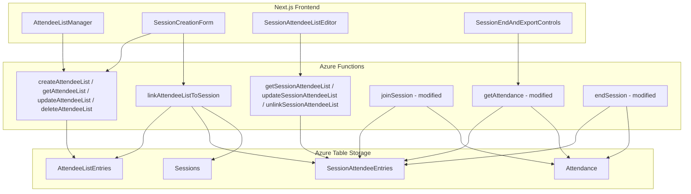
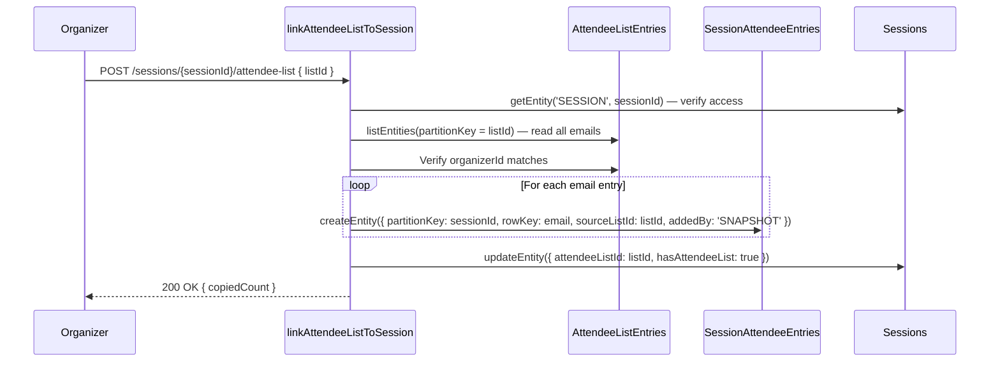

# Design Document: Attendee List Management

## Overview

This feature introduces attendee email list management to the attendance tracking system. Organizers create reusable master attendee lists (templates) and snapshot them into per-session copies at link time. The per-session copy (Session_Attendee_List) is independent of the master list after creation. Check-ins are enforced against the session's attendee list, and absentees (listed but not checked in) are computed and included in attendance exports.

The design follows existing patterns: Azure Functions HTTP triggers (TypeScript), Azure Table Storage for persistence, and Next.js React components with inline styles for the frontend.

## Architecture



The snapshot/copy flow:
1. Organizer creates a master Attendee_List → entries stored in `AttendeeListEntries`.
2. Organizer links a master list to a session → system reads all entries from `AttendeeListEntries` for that list, writes copies into `SessionAttendeeEntries` for that session, and stores the source list ID on the `Sessions` entity.
3. After snapshot, the `SessionAttendeeEntries` are fully independent. Edits to the master list do not propagate.

## Components and Interfaces

### New Azure Functions (Backend API)

| Function | Method | Route | Description |
|---|---|---|---|
| `createAttendeeList` | POST | `/attendee-lists` | Create a new master attendee list with name + emails |
| `getAttendeeLists` | GET | `/attendee-lists` | Get all master lists owned by the authenticated Organizer |
| `getAttendeeList` | GET | `/attendee-lists/{listId}` | Get a single master list with its entries |
| `updateAttendeeList` | PATCH | `/attendee-lists/{listId}` | Add/remove emails from a master list |
| `deleteAttendeeList` | DELETE | `/attendee-lists/{listId}` | Delete a master list and all its entries |
| `linkAttendeeListToSession` | POST | `/sessions/{sessionId}/attendee-list` | Snapshot a master list into the session |
| `getSessionAttendeeList` | GET | `/sessions/{sessionId}/attendee-list` | Get the per-session attendee list entries |
| `updateSessionAttendeeList` | PATCH | `/sessions/{sessionId}/attendee-list` | Add/remove emails from the per-session list |
| `unlinkSessionAttendeeList` | DELETE | `/sessions/{sessionId}/attendee-list` | Remove the per-session list (revert to open check-in) |

### Modified Azure Functions

| Function | Change |
|---|---|
| `joinSession` | Before creating attendance record, check if `SessionAttendeeEntries` exist for the session. If they do, verify the attendee's email is listed. Reject with `NOT_ON_ATTENDEE_LIST` if not found. |
| `getAttendance` | After fetching attendance records, also fetch `SessionAttendeeEntries`. Compute absentees (emails in session list but not in attendance). Include absentee records with `finalStatus: 'ABSENT'` and a summary field. |
| `endSession` | Same absentee computation as `getAttendance` — include absentees in the final attendance response. |
| `createSession` | Accept optional `attendeeListId` field. If provided, perform the snapshot copy inline after session creation. |

### New Frontend Components

| Component | Location | Description |
|---|---|---|
| `AttendeeListManager` | `frontend/src/components/AttendeeListManager.tsx` | Full CRUD UI for master attendee lists. Displayed as a new tab in the Organizer dashboard or as a standalone page. |
| `AttendeeListSelector` | `frontend/src/components/AttendeeListSelector.tsx` | Dropdown/picker for selecting an existing master list. Used inside `SessionCreationForm`. Includes an inline "create new list" option. |
| `SessionAttendeeListEditor` | `frontend/src/components/SessionAttendeeListEditor.tsx` | View/edit the per-session attendee list from the session dashboard. Add/remove individual emails. |

### Modified Frontend Components

| Component | Change |
|---|---|
| `SessionCreationForm` | Add an optional `AttendeeListSelector` section. Pass `attendeeListId` to the create session API. Also support inline list creation. |
| `OrganizerDashboardWithTabs` | Add an "Attendee Lists" tab that renders `AttendeeListManager`. |
| `SessionTab` (in dashboard) | Add a section showing the session's attendee list using `SessionAttendeeListEditor`. |
| `SessionEndAndExportControls` | Display absentee count in the summary stats. Include ABSENT records in the attendance table. |

## Data Models

### Azure Table Storage Schema

#### AttendeeListEntries Table

Stores individual email entries for master attendee lists.

| Field | Type | Description |
|---|---|---|
| `partitionKey` | string | The `listId` (UUID) — groups all emails for one master list |
| `rowKey` | string | The email address (lowercased, serves as unique key within the list) |
| `listName` | string | Name of the attendee list (denormalized for query convenience) |
| `organizerId` | string | Email of the Organizer who owns this list |
| `createdAt` | string | ISO timestamp of when this entry was added |

To retrieve all lists for an Organizer, we query with a filter on `organizerId`. To get all entries for a list, we query by `partitionKey eq '{listId}'`.

To get the list metadata (name, owner), we read any single entry from the partition — the `listName` and `organizerId` are denormalized on every row. This avoids needing a separate metadata table.

#### SessionAttendeeEntries Table

Stores the per-session snapshot of attendee emails.

| Field | Type | Description |
|---|---|---|
| `partitionKey` | string | The `sessionId` — groups all emails for one session |
| `rowKey` | string | The email address (lowercased) |
| `sourceListId` | string | The master `listId` this was copied from (for traceability) |
| `addedAt` | string | ISO timestamp of when this entry was added to the session list |
| `addedBy` | string | `'SNAPSHOT'` if copied from master list, or the Organizer email if manually added |

#### Sessions Table (Modified)

Add these fields to existing session entities:

| Field | Type | Description |
|---|---|---|
| `attendeeListId` | string? | The source master list ID (set when a list is linked/snapshotted) |
| `hasAttendeeList` | boolean? | `true` if a Session_Attendee_List exists for this session. Used as a fast check in `joinSession` to avoid querying `SessionAttendeeEntries` when no list is linked. |

#### TableNames Constant Update

Add to `backend/src/utils/database.ts`:

```typescript
export const TableNames = {
  // ... existing entries ...
  ATTENDEE_LIST_ENTRIES: 'AttendeeListEntries',
  SESSION_ATTENDEE_ENTRIES: 'SessionAttendeeEntries',
} as const;
```

### Email Validation

Emails are validated using a standard regex pattern before storage. All emails are lowercased before storage and comparison to ensure case-insensitive matching. The validation function:

```typescript
function isValidEmail(email: string): boolean {
  return /^[^\s@]+@[^\s@]+\.[^\s@]+$/.test(email);
}
```

### Snapshot Copy Flow (Detailed)




## Correctness Properties

*A property is a characteristic or behavior that should hold true across all valid executions of a system — essentially, a formal statement about what the system should do. Properties serve as the bridge between human-readable specifications and machine-verifiable correctness guarantees.*

### Property 1: List creation stores exactly the unique emails with correct ownership

*For any* valid list name, organizer ID, and set of email addresses (possibly containing duplicates), creating an Attendee_List should result in stored entries whose email set equals the unique emails from the input, and every entry should have the correct `organizerId` and `listName`.

**Validates: Requirements 1.1, 1.2, 1.4**

### Property 2: Invalid input rejection for list creation

*For any* input where at least one email fails format validation, or the list name is empty, or the email set is empty, the system should reject the creation request and return a validation error — no entries should be stored.

**Validates: Requirements 1.3, 1.5**

### Property 3: Organizer list retrieval returns exactly owned lists

*For any* organizer who owns N master attendee lists, querying their lists should return exactly those N lists and no lists owned by other organizers.

**Validates: Requirements 2.1**

### Property 4: Master list add/remove correctness

*For any* existing master list with email set S, adding a set A of new emails should result in the stored set being S ∪ A (unique), and subsequently removing a set R should result in the stored set being (S ∪ A) \ R.

**Validates: Requirements 2.2, 2.3**

### Property 5: Master list deletion removes all entries

*For any* master attendee list, after deletion, querying for that list's entries should return zero results.

**Validates: Requirements 2.4**

### Property 6: Access control rejects non-owners

*For any* master list or session owned by organizer A, when organizer B (B ≠ A and B is not a co-organizer) attempts to modify, delete, or link the list, the system should return a 403 Forbidden error and leave the data unchanged.

**Validates: Requirements 2.5, 3.4, 4.5**

### Property 7: Snapshot isolation — bidirectional independence

*For any* session that has received a snapshot from a master list, (a) modifying the master list after the snapshot should leave the session's entries unchanged, and (b) modifying the session's entries should leave the master list unchanged.

**Validates: Requirements 2.6, 3.7, 4.4**

### Property 8: Snapshot copies all emails and records source

*For any* master list with email set S linked to a session, the resulting SessionAttendeeEntries for that session should contain exactly the set S, and the session entity should have `attendeeListId` set to the source list's ID.

**Validates: Requirements 3.1, 3.2**

### Property 9: Unlink removes all session entries and reverts to open check-in

*For any* session with a Session_Attendee_List, after unlinking, the SessionAttendeeEntries for that session should be empty, and the session's `hasAttendeeList` flag should be false.

**Validates: Requirements 3.5**

### Property 10: Multiple sessions receive independent copies

*For any* master list linked to sessions S1 and S2, modifying the Session_Attendee_List of S1 should not affect the Session_Attendee_List of S2, and vice versa.

**Validates: Requirements 3.6**

### Property 11: Session list add/remove with duplicate rejection

*For any* session attendee list with email set S, adding a set A of new emails should result in the stored set being S ∪ A (unique), adding an email already in S should be rejected, and removing a set R should result in S \ R.

**Validates: Requirements 4.1, 4.2, 4.3**

### Property 12: Check-in enforcement based on attendee list presence

*For any* session and attendee, check-in should succeed if and only if either (a) the session has no Session_Attendee_List, or (b) the attendee's email exists in the Session_Attendee_List. When rejected, the error code should be `NOT_ON_ATTENDEE_LIST`.

**Validates: Requirements 5.1, 5.2, 5.3, 5.4**

### Property 13: Absentee computation is the set difference

*For any* session with a Session_Attendee_List of email set L and attendance records for email set A, the absentee set should equal L \ A, and each absentee record should have `finalStatus` set to `ABSENT`.

**Validates: Requirements 6.1, 6.2, 6.3**

### Property 14: Attendance export includes absentees with consistent summary

*For any* session with a Session_Attendee_List, the attendance export should include one record per absentee with `finalStatus: 'ABSENT'`, and the summary should satisfy `totalListed == presentCount + absentCount` where `totalListed` equals the session list size.

**Validates: Requirements 7.1, 7.2**

### Property 15: No-list session export is unchanged

*For any* session without a Session_Attendee_List, the attendance export should contain only actual attendance records with no absentee records and no attendee list summary.

**Validates: Requirements 7.3**

### Property 16: Email input parsing handles comma and newline separators

*For any* string containing valid email addresses separated by commas, newlines, or a mix of both, the parser should extract exactly the set of trimmed, non-empty email addresses.

**Validates: Requirements 8.4**

## Error Handling

### Backend Error Responses

All error responses follow the existing pattern:

```typescript
{
  error: {
    code: string;       // Machine-readable error code
    message: string;    // Human-readable description
    details?: any;      // Optional additional context
    timestamp: number;  // Unix timestamp
  }
}
```

### Error Codes

| Code | HTTP Status | Condition |
|---|---|---|
| `UNAUTHORIZED` | 401 | Missing or invalid authentication |
| `FORBIDDEN` | 403 | User lacks Organizer role or doesn't own the resource |
| `NOT_FOUND` | 404 | List or session not found |
| `INVALID_REQUEST` | 400 | Missing required fields, empty name, empty email list |
| `INVALID_EMAIL` | 400 | One or more emails fail format validation. Response includes `invalidEmails` array. |
| `DUPLICATE_EMAIL` | 409 | Attempting to add an email that already exists in the session list |
| `NOT_ON_ATTENDEE_LIST` | 403 | Attendee check-in rejected because their email is not on the session's attendee list |
| `LIST_ALREADY_LINKED` | 409 | Session already has a Session_Attendee_List (must unlink first) |
| `INTERNAL_ERROR` | 500 | Unexpected server error |

### Frontend Error Handling

- API errors are displayed in the existing error banner pattern (red background, icon, message text).
- Email validation errors highlight the specific invalid entries in the input form.
- Network errors trigger a retry prompt.
- Optimistic UI is not used — all mutations wait for server confirmation before updating the UI.

## Testing Strategy

### Unit Tests

Unit tests cover specific examples and edge cases:

- Creating a list with exactly one email
- Creating a list with all duplicate emails (should store one)
- Email validation edge cases: missing `@`, missing domain, spaces, unicode
- Empty list name, empty email array
- Snapshot with an empty master list (edge case — should create an empty session list)
- Unlinking a session that has no list (should be a no-op or 404)
- Check-in with case-mismatched email (e.g., `User@Example.com` vs `user@example.com`)
- Absentee computation with zero attendance (all listed are absent)
- Absentee computation with full attendance (zero absentees)
- Export summary arithmetic: `presentCount + absentCount == totalListed`

### Property-Based Tests

Property-based tests use [fast-check](https://github.com/dubzzz/fast-check) (the standard PBT library for TypeScript/JavaScript). Each property test runs a minimum of 100 iterations.

Each test is tagged with a comment referencing the design property:

```typescript
// Feature: attendee-list-management, Property 1: List creation stores exactly the unique emails with correct ownership
```

Properties to implement as PBT:

1. **Property 1** — Generate random list names and email sets (with duplicates). Verify stored entries = unique input emails with correct owner.
2. **Property 2** — Generate inputs with invalid emails / empty names. Verify rejection.
3. **Property 4** — Generate initial email sets, add sets, remove sets. Verify set operations.
4. **Property 7** — Snapshot, then modify master. Verify session unchanged. Modify session. Verify master unchanged.
5. **Property 8** — Generate master lists, link to session. Verify exact copy and source ID.
6. **Property 10** — Link one master to two sessions. Modify one session's list. Verify the other is unchanged.
7. **Property 11** — Generate session list operations (add/remove/duplicate add). Verify correctness.
8. **Property 12** — Generate sessions with/without lists and attendees on/off the list. Verify check-in outcome.
9. **Property 13** — Generate session lists and attendance subsets. Verify absentee set = difference.
10. **Property 14** — Generate exports with lists. Verify summary arithmetic.
11. **Property 16** — Generate email strings with mixed comma/newline separators. Verify parsed output.

### Test Configuration

```typescript
import fc from 'fast-check';

// Minimum 100 iterations per property
const PBT_CONFIG = { numRuns: 100 };

// Email generator
const emailArb = fc.tuple(
  fc.stringOf(fc.constantFrom(...'abcdefghijklmnopqrstuvwxyz0123456789'.split('')), { minLength: 1, maxLength: 10 }),
  fc.stringOf(fc.constantFrom(...'abcdefghijklmnopqrstuvwxyz'.split('')), { minLength: 1, maxLength: 8 }),
  fc.constantFrom('com', 'org', 'edu', 'net')
).map(([local, domain, tld]) => `${local}@${domain}.${tld}`);

// Email set generator (with possible duplicates)
const emailSetArb = fc.array(emailArb, { minLength: 1, maxLength: 50 });
```
