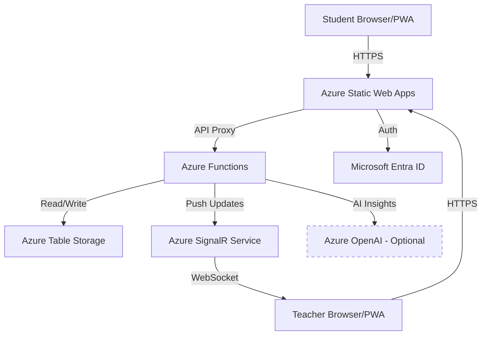
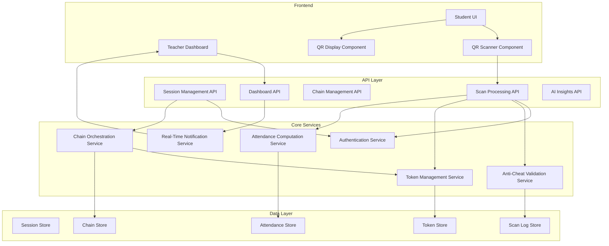
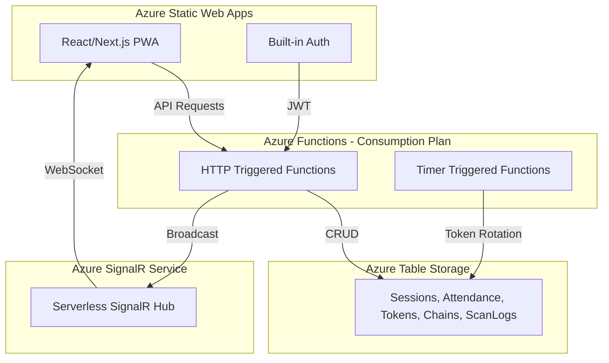

# Design Document: QR Chain Attendance System

## Overview

The QR Chain Attendance System is an Azure-based classroom attendance solution that uses peer-to-peer QR code chains and rotating QR codes to verify student presence while resisting common cheating methods (screenshots, remote scans, proxy attendance). The system implements a full entry-exit verification cycle with support for late arrivals and early departures.

### Key Design Principles

1. **Anti-Cheat First**: Short-lived tokens (20s for chains, 60s for rotating), single-use enforcement via ETag concurrency control, and optional location constraints
2. **Peer Verification**: Students verify each other through chain scanning, distributing trust and preventing single-point manipulation
3. **Real-Time Visibility**: Teachers see live attendance status and chain progress via SignalR
4. **Scalability**: Optimized for 300-500 students per session with p95 latency < 400ms
5. **Serverless Architecture**: Azure Functions + Static Web Apps for automatic scaling and cost efficiency

### Architecture Style

Event-driven serverless architecture with:
- Static frontend (React/Next.js PWA)
- HTTP-triggered Azure Functions for API operations
- Timer-triggered Azure Functions for token rotation and cleanup
- Azure SignalR Service for real-time push updates
- Azure Table Storage for persistence (optimized with PartitionKey=sessionId)

## Architecture

### System Context



### Component Architecture



### Deployment Architecture



## Components and Interfaces

### 1. Authentication Service

**Responsibility**: Validate user identity and extract role information from Entra ID tokens.

**Interface**:
```typescript
interface AuthService {
  // Parse x-ms-client-principal header from SWA
  parseUserPrincipal(header: string): UserPrincipal
  
  // Validate user has required role
  requireRole(principal: UserPrincipal, role: Role): void
  
  // Extract user ID and email
  getUserId(principal: UserPrincipal): string
  getUserEmail(principal: UserPrincipal): string
}

interface UserPrincipal {
  userId: string
  userEmail: string
  userRoles: Role[]
  identityProvider: string
}

enum Role {
  STUDENT = "student",
  TEACHER = "teacher"
}
```

**Key Behaviors**:
- Parse base64-encoded JSON from `x-ms-client-principal` header
- Determine role based on email domain (@stu.edu.hk → STUDENT, @vtc.edu.hk → TEACHER)
- Throw `UnauthorizedError` if required role not present

### 2. Session Management API

**Responsibility**: Handle session lifecycle (create, start chains, end session).

**Endpoints**:
```typescript
// POST /api/sessions
interface CreateSessionRequest {
  classId: string
  startAt: string  // ISO 8601
  endAt: string    // ISO 8601
  lateCutoffMinutes: number
  exitWindowMinutes?: number
  constraints?: SessionConstraints
}

interface SessionConstraints {
  geofence?: {
    latitude: number
    longitude: number
    radiusMeters: number
  }
  wifiAllowlist?: string[]  // SSIDs
}

interface CreateSessionResponse {
  sessionId: string
  sessionQR: string  // Base64 encoded QR data
}

// POST /api/sessions/{sessionId}/seed-entry?count=K
interface SeedEntryResponse {
  chainsCreated: number
  initialHolders: string[]  // studentIds
}

// POST /api/sessions/{sessionId}/end
interface EndSessionResponse {
  finalAttendance: AttendanceRecord[]
}
```

**Authorization**: Teacher role required for all endpoints.

### 3. Token Management Service

**Responsibility**: Create, validate, and manage token lifecycle with TTL and single-use enforcement.

**Interface**:
```typescript
interface TokenService {
  // Create a new token
  createToken(params: CreateTokenParams): Token
  
  // Validate token and mark as used (atomic via ETag)
  consumeToken(tokenId: string, etag: string): ConsumeResult
  
  // Check if token is valid (not expired, not used)
  validateToken(tokenId: string): ValidationResult
  
  // Revoke a token
  revokeToken(tokenId: string): void
}

interface CreateTokenParams {
  sessionId: string
  type: TokenType
  chainId?: string
  issuedTo?: string  // holderId for chain tokens
  seq?: number
  ttlSeconds: number
  singleUse: boolean
}

enum TokenType {
  SESSION = "SESSION",
  CHAIN = "CHAIN",
  LATE_ENTRY = "LATE_ENTRY",
  EARLY_LEAVE = "EARLY_LEAVE",
  EXIT_CHAIN = "EXIT_CHAIN"
}

interface Token {
  tokenId: string
  sessionId: string
  type: TokenType
  chainId?: string
  issuedTo?: string
  seq?: number
  exp: number  // Unix timestamp
  status: TokenStatus
  singleUse: boolean
  etag: string
}

enum TokenStatus {
  ACTIVE = "ACTIVE",
  USED = "USED",
  EXPIRED = "EXPIRED",
  REVOKED = "REVOKED"
}

interface ConsumeResult {
  success: boolean
  token?: Token
  error?: "ALREADY_USED" | "EXPIRED" | "REVOKED" | "NOT_FOUND"
}
```

**Key Behaviors**:
- Generate cryptographically random tokenId (32 bytes, base64url encoded)
- Store token in TokenStore with ETag for optimistic concurrency
- On consume: read token, check status/expiration, update status=USED with ETag condition
- If ETag mismatch: return ALREADY_USED error (another request consumed it first)
- Timer function runs every 60s to mark expired tokens (exp < now)

### 4. Chain Orchestration Service

**Responsibility**: Manage entry and exit chain state, holder selection, and baton transfers.

**Interface**:
```typescript
interface ChainService {
  // Seed initial chains by selecting random students
  seedChains(sessionId: string, phase: ChainPhase, count: number): Chain[]
  
  // Process a chain scan (validate, mark holder, transfer baton)
  processChainScan(params: ChainScanParams): ChainScanResult
  
  // Detect stalled chains (idle > threshold)
  detectStalledChains(sessionId: string, phase: ChainPhase): Chain[]
  
  // Reseed stalled chains
  reseedChains(sessionId: string, phase: ChainPhase, count: number): Chain[]
}

enum ChainPhase {
  ENTRY = "ENTRY",
  EXIT = "EXIT"
}

interface Chain {
  sessionId: string
  phase: ChainPhase
  chainId: string
  index: number  // Incremented on reseed
  state: ChainState
  lastHolder?: string
  lastSeq: number
  lastAt?: number  // Unix timestamp
}

enum ChainState {
  ACTIVE = "ACTIVE",
  STALLED = "STALLED",
  COMPLETED = "COMPLETED"
}

interface ChainScanParams {
  sessionId: string
  tokenId: string
  etag: string
  scannerId: string
  scanMetadata: ScanMetadata
}

interface ChainScanResult {
  success: boolean
  holderMarked?: string  // studentId who got credit
  newHolder?: string     // studentId who became new holder
  error?: string
}
```

**Key Behaviors**:
- **Seed**: Query AttendanceStore for eligible students (joined but not yet marked), randomly select K, create Chain records, issue Chain_Tokens
- **Process Scan**: 
  1. Consume token via TokenService (atomic ETag check)
  2. If successful, mark holder with attendance status (PRESENT_ENTRY or exitVerified=true)
  3. If ownerTransfer=true, create new token for scanner with seq+1
  4. Update Chain record with new lastHolder, lastSeq, lastAt
  5. Broadcast update via SignalRService
- **Stall Detection**: Query chains where (now - lastAt) > 90s and state=ACTIVE
- **Reseed**: Create new chains with index+1, issue new tokens to different random students

### 5. Scan Processing API

**Responsibility**: Handle all QR scan requests with validation, anti-cheat checks, and audit logging.

**Endpoints**:
```typescript
// POST /api/scan/chain
interface ChainScanRequest {
  tokenId: string
  etag: string
  metadata: ScanMetadata
}

interface ScanMetadata {
  deviceFingerprint: string
  gps?: { latitude: number; longitude: number }
  bssid?: string
  userAgent: string
}

interface ChainScanResponse {
  success: boolean
  holderMarked?: string
  newHolder?: string
  newToken?: string  // If baton transferred
  newTokenEtag?: string
  error?: string
}

// POST /api/scan/late-entry
interface LateEntryScanRequest {
  tokenId: string
  etag: string
  metadata: ScanMetadata
}

// POST /api/scan/early-leave
interface EarlyLeaveScanRequest {
  tokenId: string
  etag: string
  metadata: ScanMetadata
}

// POST /api/scan/exit-chain
interface ExitChainScanRequest {
  tokenId: string
  etag: string
  metadata: ScanMetadata
}
```

**Authorization**: Student role required for all scan endpoints.

**Processing Flow**:
1. Extract user principal from auth header
2. Validate rate limits (per device, per IP)
3. Validate location constraints if configured (geofence, SSID)
4. Delegate to appropriate service (ChainService for chains, AttendanceService for late/early)
5. Log scan attempt to ScanLogStore (success or failure)
6. Return result to client

### 6. Anti-Cheat Validation Service

**Responsibility**: Enforce rate limits, location constraints, and audit logging.

**Interface**:
```typescript
interface ValidationService {
  // Check rate limits
  checkRateLimit(deviceFingerprint: string, ip: string): RateLimitResult
  
  // Validate location constraints
  validateLocation(sessionId: string, metadata: ScanMetadata): LocationValidationResult
  
  // Log scan attempt
  logScan(params: ScanLogParams): void
}

interface RateLimitResult {
  allowed: boolean
  reason?: "DEVICE_LIMIT" | "IP_LIMIT"
}

interface LocationValidationResult {
  valid: boolean
  reason?: "GEOFENCE_VIOLATION" | "WIFI_VIOLATION"
}

interface ScanLogParams {
  sessionId: string
  flow: ScanFlow
  tokenId: string
  holderId?: string
  scannerId: string
  deviceFingerprint: string
  ip: string
  bssid?: string
  gps?: { latitude: number; longitude: number }
  userAgent: string
  result: ScanResult
  error?: string
}

enum ScanFlow {
  ENTRY_CHAIN = "ENTRY_CHAIN",
  LATE_ENTRY = "LATE_ENTRY",
  EARLY_LEAVE = "EARLY_LEAVE",
  EXIT_CHAIN = "EXIT_CHAIN"
}

enum ScanResult {
  SUCCESS = "SUCCESS",
  RATE_LIMITED = "RATE_LIMITED",
  LOCATION_VIOLATION = "LOCATION_VIOLATION",
  TOKEN_INVALID = "TOKEN_INVALID",
  TOKEN_EXPIRED = "TOKEN_EXPIRED",
  TOKEN_USED = "TOKEN_USED",
  UNAUTHORIZED = "UNAUTHORIZED"
}
```

**Key Behaviors**:
- **Rate Limiting**: Use in-memory cache (Azure Functions host-level) with sliding window counters
  - Device: max 10 scans per 60s
  - IP: max 50 scans per 60s
- **Geofence**: Calculate distance using Haversine formula, reject if > radiusMeters
- **Wi-Fi**: Check if BSSID prefix matches any allowed SSID (BSSID lookup via client-provided mapping)
- **Audit Log**: Write to ScanLogStore with PartitionKey=sessionId for efficient teacher queries

### 7. Attendance Computation Service

**Responsibility**: Update attendance records based on scan events and compute final status.

**Interface**:
```typescript
interface AttendanceService {
  // Mark student with entry status
  markEntry(sessionId: string, studentId: string, status: EntryStatus): void
  
  // Mark student exit verified
  markExitVerified(sessionId: string, studentId: string): void
  
  // Mark student early leave
  markEarlyLeave(sessionId: string, studentId: string): void
  
  // Compute final status for all students
  computeFinalStatus(sessionId: string): AttendanceRecord[]
}

enum EntryStatus {
  PRESENT_ENTRY = "PRESENT_ENTRY",
  LATE_ENTRY = "LATE_ENTRY"
}

enum FinalStatus {
  PRESENT = "PRESENT",
  LATE = "LATE",
  LEFT_EARLY = "LEFT_EARLY",
  EARLY_LEAVE = "EARLY_LEAVE",
  ABSENT = "ABSENT"
}

interface AttendanceRecord {
  sessionId: string
  studentId: string
  entryStatus?: EntryStatus
  entryAt?: number
  exitVerified: boolean
  exitVerifiedAt?: number
  earlyLeaveAt?: number
  finalStatus?: FinalStatus
}
```

**Key Behaviors**:
- **Mark Entry**: Update AttendanceRecord with entryStatus and entryAt timestamp
- **Mark Exit**: Set exitVerified=true and exitVerifiedAt timestamp
- **Mark Early Leave**: Set earlyLeaveAt timestamp
- **Compute Final**: Apply decision tree:
  ```
  if (earlyLeaveAt exists) → EARLY_LEAVE
  else if (PRESENT_ENTRY && exitVerified) → PRESENT
  else if (PRESENT_ENTRY && !exitVerified) → LEFT_EARLY
  else if (LATE_ENTRY && exitVerified) → LATE
  else if (LATE_ENTRY && !exitVerified) → LEFT_EARLY
  else → ABSENT
  ```

### 8. Real-Time Notification Service

**Responsibility**: Push attendance updates to teacher dashboard via SignalR.

**Interface**:
```typescript
interface SignalRService {
  // Broadcast attendance update to session dashboard
  broadcastAttendanceUpdate(sessionId: string, update: AttendanceUpdate): void
  
  // Broadcast chain status update
  broadcastChainUpdate(sessionId: string, update: ChainUpdate): void
  
  // Broadcast stall alert
  broadcastStallAlert(sessionId: string, chainIds: string[]): void
}

interface AttendanceUpdate {
  studentId: string
  entryStatus?: EntryStatus
  exitVerified?: boolean
  earlyLeaveAt?: number
}

interface ChainUpdate {
  chainId: string
  phase: ChainPhase
  lastHolder: string
  lastSeq: number
  state: ChainState
}
```

**Implementation**:
- Use Azure SignalR Service output binding in Azure Functions
- Teacher dashboard connects via `/api/sessions/{sessionId}/dashboard/negotiate` endpoint
- SignalR connection authenticated with same Entra ID token
- Messages sent to group `session:{sessionId}` for targeted delivery

### 9. Dashboard API

**Responsibility**: Provide teacher dashboard data and SignalR negotiation.

**Endpoints**:
```typescript
// GET /api/sessions/{sessionId}
interface SessionStatusResponse {
  session: Session
  attendance: AttendanceRecord[]
  chains: Chain[]
  stats: SessionStats
}

interface SessionStats {
  totalStudents: number
  presentEntry: number
  lateEntry: number
  earlyLeave: number
  exitVerified: number
  notYetVerified: number
}

// POST /api/sessions/{sessionId}/dashboard/negotiate
// Returns SignalR connection info (handled by Azure Functions SignalR binding)

// GET /api/sessions/{sessionId}/attendance
interface AttendanceResponse {
  attendance: AttendanceRecord[]
}
```

**Authorization**: Teacher role required, must be session owner.

### 10. Rotating QR Management

**Responsibility**: Generate and rotate late entry and early leave QR codes.

**Implementation**:
- **Timer Function**: Runs every 60 seconds
  - Query sessions with active late entry or early leave windows
  - Mark expired tokens as EXPIRED
  - Generate new tokens for active windows
  - Store new token IDs in Session record for client retrieval
- **GET Endpoints**: Return current active token for display
  - `/api/sessions/{sessionId}/late-qr`
  - `/api/sessions/{sessionId}/early-qr`
- **Client Polling**: Teacher UI polls every 55 seconds to fetch new QR before expiration

## Data Models

### Azure Table Storage Schema

All entities use Azure Table Storage with optimized partitioning for query performance.

#### Sessions Table

```typescript
interface SessionEntity {
  // Azure Table Storage keys
  PartitionKey: string    // "SESSION"
  RowKey: string          // sessionId (GUID)
  
  // Session data
  classId: string
  teacherId: string
  startAt: string         // ISO 8601
  endAt: string           // ISO 8601
  lateCutoffMinutes: number
  exitWindowMinutes: number
  status: SessionStatus
  
  // Configuration
  ownerTransfer: boolean
  constraints?: string    // JSON serialized SessionConstraints
  
  // Current state
  lateEntryActive: boolean
  currentLateTokenId?: string
  earlyLeaveActive: boolean
  currentEarlyTokenId?: string
  
  // Timestamps
  createdAt: string
  endedAt?: string
  
  // Azure Table Storage metadata
  Timestamp: Date
  ETag: string
}

enum SessionStatus {
  ACTIVE = "ACTIVE",
  ENDED = "ENDED"
}
```

**Query Patterns**:
- Get session by ID: `PartitionKey = "SESSION" AND RowKey = sessionId`
- List teacher's sessions: Secondary index on teacherId (or scan with filter)

#### Attendance Table

```typescript
interface AttendanceEntity {
  // Azure Table Storage keys
  PartitionKey: string    // sessionId (for efficient session queries)
  RowKey: string          // studentId
  
  // Entry tracking
  entryStatus?: string    // "PRESENT_ENTRY" | "LATE_ENTRY"
  entryAt?: number        // Unix timestamp
  
  // Exit tracking
  exitVerified: boolean
  exitVerifiedAt?: number
  
  // Early leave tracking
  earlyLeaveAt?: number
  
  // Final status
  finalStatus?: string    // "PRESENT" | "LATE" | "LEFT_EARLY" | "EARLY_LEAVE" | "ABSENT"
  
  // Azure Table Storage metadata
  Timestamp: Date
  ETag: string
}
```

**Query Patterns**:
- Get all attendance for session: `PartitionKey = sessionId`
- Get student's attendance: `PartitionKey = sessionId AND RowKey = studentId`
- Update attendance: Use ETag for optimistic concurrency

#### Tokens Table

```typescript
interface TokenEntity {
  // Azure Table Storage keys
  PartitionKey: string    // sessionId (for efficient cleanup)
  RowKey: string          // tokenId
  
  // Token data
  type: string            // TokenType enum
  chainId?: string
  issuedTo?: string       // holderId for chain tokens
  seq?: number
  exp: number             // Unix timestamp
  status: string          // TokenStatus enum
  singleUse: boolean
  
  // Timestamps
  createdAt: number
  usedAt?: number
  
  // Azure Table Storage metadata
  Timestamp: Date
  ETag: string
}
```

**Query Patterns**:
- Get token by ID: `PartitionKey = sessionId AND RowKey = tokenId`
- Consume token: Read with ETag, update status=USED with ETag condition
- Cleanup expired: Query `PartitionKey = sessionId AND exp < now`, batch delete

#### Chains Table

```typescript
interface ChainEntity {
  // Azure Table Storage keys
  PartitionKey: string    // sessionId (for efficient session queries)
  RowKey: string          // chainId
  
  // Chain data
  phase: string           // "ENTRY" | "EXIT"
  index: number           // Incremented on reseed
  state: string           // ChainState enum
  lastHolder?: string
  lastSeq: number
  lastAt?: number         // Unix timestamp
  
  // Timestamps
  createdAt: number
  
  // Azure Table Storage metadata
  Timestamp: Date
  ETag: string
}
```

**Query Patterns**:
- Get all chains for session: `PartitionKey = sessionId`
- Get chains by phase: `PartitionKey = sessionId AND phase = "ENTRY"`
- Detect stalled: Query `PartitionKey = sessionId AND state = "ACTIVE"`, filter in code by lastAt

#### ScanLogs Table

```typescript
interface ScanLogEntity {
  // Azure Table Storage keys
  PartitionKey: string    // sessionId (for efficient teacher queries)
  RowKey: string          // timestamp + random (for uniqueness and time-ordered)
  
  // Scan data
  flow: string            // ScanFlow enum
  tokenId: string
  holderId?: string
  scannerId: string
  
  // Metadata
  deviceFingerprint: string
  ip: string
  bssid?: string
  gps?: string            // JSON serialized coordinates
  userAgent: string
  
  // Result
  result: string          // ScanResult enum
  error?: string
  
  // Timestamp
  scannedAt: number       // Unix timestamp
  
  // Azure Table Storage metadata
  Timestamp: Date
}
```

**Query Patterns**:
- Get all scans for session: `PartitionKey = sessionId`
- Get recent scans: `PartitionKey = sessionId`, take top N (time-ordered by RowKey)
- Audit investigation: Filter by scannerId, result, or flow

### QR Code Data Format

QR codes encode JSON payloads with type discrimination:

```typescript
// Session join QR
interface SessionQRData {
  type: "SESSION"
  sessionId: string
  classId: string
}

// Chain token QR (displayed by holder)
interface ChainQRData {
  type: "CHAIN" | "EXIT_CHAIN"
  sessionId: string
  tokenId: string
  etag: string
  holderId: string
  exp: number
}

// Rotating QR (displayed by teacher)
interface RotatingQRData {
  type: "LATE_ENTRY" | "EARLY_LEAVE"
  sessionId: string
  tokenId: string
  etag: string
  exp: number
}
```

**QR Generation**:
- Serialize JSON to string
- Encode as QR code (error correction level M)
- Display with countdown timer showing TTL

**QR Scanning**:
- Parse JSON from QR code
- Validate type and required fields
- Extract tokenId and etag for API call
- Include scan metadata (GPS, BSSID, device fingerprint)


## Correctness Properties

*A property is a characteristic or behavior that should hold true across all valid executions of a system—essentially, a formal statement about what the system should do. Properties serve as the bridge between human-readable specifications and machine-verifiable correctness guarantees.*

### Authentication and Authorization Properties

**Property 1: Student role assignment by email domain**
*For any* user with an @stu.edu.hk email address, the system should assign them the Student role.
**Validates: Requirements 1.1**

**Property 2: Teacher role assignment by email domain**
*For any* user with an @vtc.edu.hk email address, the system should assign them the Teacher role.
**Validates: Requirements 1.2**

**Property 3: Teacher endpoint authorization enforcement**
*For any* user without the Teacher role, attempting to access any teacher-only endpoint should result in an authorization error.
**Validates: Requirements 1.3**

**Property 4: Student endpoint authorization enforcement**
*For any* user without the Student role, attempting to access any student-only endpoint should result in an authorization error.
**Validates: Requirements 1.4**

**Property 5: Server-side role validation**
*For any* API request, the system should validate user roles on the server side regardless of client-side state.
**Validates: Requirements 1.6**

### Session Management Properties

**Property 6: Session creation requires all mandatory fields**
*For any* session creation request missing classId, startAt, endAt, or lateCutoffMinutes, the system should reject the request.
**Validates: Requirements 2.1**

**Property 7: New sessions initialize as ACTIVE**
*For any* newly created session, its status should be ACTIVE.
**Validates: Requirements 2.2**

**Property 8: Ending session transitions to ENDED status**
*For any* active session, when a teacher ends it, the status should change to ENDED.
**Validates: Requirements 2.3**

**Property 9: Session configuration round-trip**
*For any* session created with specific configuration (constraints, ownerTransfer, exitWindowMinutes), retrieving that session should return the same configuration.
**Validates: Requirements 2.4**

**Property 10: Session QR uniqueness**
*For any* set of created sessions, all Session_QR codes should be unique.
**Validates: Requirements 2.5**

### Entry Chain Properties

**Property 11: Entry chain seeding creates exact count**
*For any* positive integer K, when a teacher seeds K entry chains, exactly K chains should be created.
**Validates: Requirements 3.1**

**Property 12: Chain token TTL is 20 seconds**
*For any* chain token, its expiration time should be 20 seconds from creation.
**Validates: Requirements 3.2**

**Property 13: Chain scan marks holder as present**
*For any* valid chain scan where a scanner scans a holder's QR code, the holder should be marked as PRESENT_ENTRY.
**Validates: Requirements 3.3**

**Property 14: Baton transfer on chain scan**
*For any* valid chain scan, the scanner should become the new holder with a new token.
**Validates: Requirements 3.4**

**Property 15: Expired tokens reject scans**
*For any* chain token that has expired, attempting to scan it should be rejected.
**Validates: Requirements 3.5**

**Property 16: Sequence number monotonically increases**
*For any* chain, the sequence number should increase by 1 with each baton transfer.
**Validates: Requirements 3.6**

**Property 17: Single-use token enforcement**
*For any* token, attempting to scan it a second time should fail due to ETag concurrency control.
**Validates: Requirements 3.7, 4.4, 5.5, 6.6, 8.3, 8.4**

**Property 18: Scan audit logging completeness**
*For any* scan attempt (success or failure), a Scan_Log entry should be created with all required fields (holderId, scannerId, deviceFingerprint, IP, BSSID, result).
**Validates: Requirements 3.8, 4.5, 5.6, 6.7, 15.1, 15.2, 15.3, 15.4**

### Late Entry Properties

**Property 19: Late entry token TTL is 60 seconds**
*For any* late entry token, its expiration time should be 60 seconds from creation.
**Validates: Requirements 4.1**

**Property 20: Late entry token rotation**
*For any* active late entry window, when a token expires, a new token with a different value should be automatically generated.
**Validates: Requirements 4.2**

**Property 21: Late entry scan marks student**
*For any* student scanning a valid late entry QR code, they should be marked as LATE_ENTRY.
**Validates: Requirements 4.3**

**Property 22: Late entry timing enforcement**
*For any* scan attempt before the late cutoff time, the system should reject late entry scans.
**Validates: Requirements 4.6**

### Early Leave Properties

**Property 23: Early leave token rotation**
*For any* active early-leave window, tokens should rotate every 60 seconds.
**Validates: Requirements 5.1**

**Property 24: Early leave window control**
*For any* early-leave window, when a teacher stops it, no new tokens should be generated.
**Validates: Requirements 5.2**

**Property 25: Early leave timestamp recording**
*For any* student scanning a valid early-leave QR code, an earlyLeaveAt timestamp should be recorded.
**Validates: Requirements 5.3**

**Property 26: Early leave status priority**
*For any* student with an earlyLeaveAt timestamp, their final status should be EARLY_LEAVE regardless of other attendance states.
**Validates: Requirements 5.4, 7.1**

### Exit Chain Properties

**Property 27: Exit chain seeding creates exact count**
*For any* positive integer K, when a teacher starts K exit chains, exactly K chains should be created.
**Validates: Requirements 6.1**

**Property 28: Exit chain eligibility filtering**
*For any* exit chain seeding, only students with PRESENT_ENTRY or LATE_ENTRY status who did not early-leave should be selected.
**Validates: Requirements 6.2**

**Property 29: Exit scan marks holder verified**
*For any* valid exit chain scan, the holder should have exitVerified set to true.
**Validates: Requirements 6.3**

**Property 30: Exit baton transfer**
*For any* valid exit chain scan, the scanner should become the new holder.
**Validates: Requirements 6.4**

**Property 31: Exit token expiration**
*For any* exit chain token, it should expire after 20 seconds and be marked as EXPIRED.
**Validates: Requirements 6.5**

### Final Attendance Computation Properties

**Property 32: Final status computation logic**
*For any* student when a session ends, their final status should be computed according to the decision tree:
- If earlyLeaveAt exists → EARLY_LEAVE
- Else if PRESENT_ENTRY + exitVerified → PRESENT
- Else if PRESENT_ENTRY + !exitVerified → LEFT_EARLY
- Else if LATE_ENTRY + exitVerified → LATE
- Else if LATE_ENTRY + !exitVerified → LEFT_EARLY
- Else → ABSENT
**Validates: Requirements 7.1, 7.2, 7.3, 7.4, 7.5, 7.6**

**Property 33: Final status persistence round-trip**
*For any* session that has been ended, retrieving attendance records should return the same final status values that were computed.
**Validates: Requirements 7.7**

### Location-Based Anti-Cheat Properties

**Property 34: Wi-Fi allowlist enforcement**
*For any* session with SSID_Allowlist configured, scans with BSSIDs not matching the allowlist should be rejected.
**Validates: Requirements 9.1**

**Property 35: Geofence enforcement**
*For any* session with geofence configured, scans with GPS coordinates outside the radius should be rejected.
**Validates: Requirements 9.2**

**Property 36: Location validation failure logging**
*For any* scan that fails location validation, it should be rejected and logged in Scan_Logs.
**Validates: Requirements 9.3**

**Property 37: Optional location validation**
*For any* session without location constraints, scans should succeed regardless of BSSID or GPS coordinates.
**Validates: Requirements 9.4**

**Property 38: Location data audit logging**
*For any* scan attempt, BSSID, GPS coordinates, and validation results should be recorded in Scan_Logs.
**Validates: Requirements 9.5**

### Rate Limiting Properties

**Property 39: Device rate limiting**
*For any* device, the 11th scan attempt within 60 seconds should be rejected with a rate limit error.
**Validates: Requirements 10.1**

**Property 40: IP rate limiting**
*For any* IP address, the 51st scan attempt within 60 seconds should be rejected with a rate limit error.
**Validates: Requirements 10.2**

**Property 41: Rate limit logging**
*For any* rate-limited scan attempt, it should be recorded in Scan_Logs.
**Validates: Requirements 10.4**

**Property 42: Rate limit window reset**
*For any* device or IP that hit rate limits, after 60 seconds, new scan attempts should be allowed.
**Validates: Requirements 10.5**

### Chain Stall Detection Properties

**Property 43: Stall detection threshold**
*For any* chain that has been idle for more than 90 seconds, it should be marked as stalled.
**Validates: Requirements 11.1**

**Property 44: Stall status reporting**
*For any* session with stalled chains, querying chain status should report which chains are stalled.
**Validates: Requirements 11.2**

**Property 45: Chain reseeding creates exact count**
*For any* positive integer N, when a teacher reseeds with count N, exactly N new chains should be created.
**Validates: Requirements 11.3**

**Property 46: Reseed increments chain index**
*For any* chain that is reseeded, its index should be incremented by 1.
**Validates: Requirements 11.5**

### Real-Time Dashboard Properties

**Property 47: Attendance status change notification**
*For any* student whose attendance status changes, the teacher's dashboard should receive a real-time update via SignalR.
**Validates: Requirements 12.1**

**Property 48: Chain scan notification**
*For any* chain scan, the dashboard should receive an update with the new holder information.
**Validates: Requirements 12.2**

**Property 49: Stall alert notification**
*For any* chain that becomes stalled, the dashboard should display a stall indicator.
**Validates: Requirements 12.3**

**Property 50: Dashboard count accuracy**
*For any* session, the dashboard counts (PRESENT_ENTRY, LATE_ENTRY, EARLY_LEAVE, not-yet-verified) should match the actual attendance records.
**Validates: Requirements 12.4**

**Property 51: SignalR authentication enforcement**
*For any* SignalR connection attempt with an invalid token, the connection should be rejected.
**Validates: Requirements 12.6**

### Student Enrollment Properties

**Property 52: Session enrollment via QR**
*For any* student scanning a Session_QR code, they should be enrolled in that session.
**Validates: Requirements 13.1**

### Attendance Export Properties

**Property 53: Export completeness for ended sessions**
*For any* ended session, exporting attendance should return records for all enrolled students with finalStatus.
**Validates: Requirements 14.1**

**Property 54: Export field completeness**
*For any* exported attendance record, it should include studentId, entryStatus, entryAt, exitVerified, exitVerifiedAt, earlyLeaveAt, and finalStatus.
**Validates: Requirements 14.2**

**Property 55: Export JSON format validity**
*For any* attendance export, the returned data should be valid JSON.
**Validates: Requirements 14.3**

**Property 56: Active session export excludes finalStatus**
*For any* active (not ended) session, exporting attendance should return records without finalStatus.
**Validates: Requirements 14.4**

**Property 57: Attendance query authorization**
*For any* teacher attempting to query attendance for a session they did not create, the request should be rejected.
**Validates: Requirements 14.5**

### Concurrent Access Properties

**Property 58: Concurrent token consumption**
*For any* token, when multiple concurrent scan requests occur, only one should succeed and the others should fail with ETag conflict.
**Validates: Requirements 16.5**

### AI Insights Properties

**Property 59: AI insights exclude PII**
*For any* AI insights response, it should not contain student names, IDs, or other personally identifiable information.
**Validates: Requirements 17.1**

**Property 60: AI insights use aggregated data only**
*For any* AI insights generation, the system should only query aggregated data, not individual student records.
**Validates: Requirements 17.5**

**Property 61: Session statistics accuracy**
*For any* session with known scan data, the computed statistics (average scan time, chain completion rate) should match the actual values.
**Validates: Requirements 17.3**

## Error Handling

### Error Categories

1. **Authentication Errors**
   - `UNAUTHORIZED`: Missing or invalid authentication token
   - `FORBIDDEN`: Valid authentication but insufficient role/permissions

2. **Validation Errors**
   - `INVALID_REQUEST`: Missing required fields or invalid field values
   - `EXPIRED_TOKEN`: Token TTL exceeded
   - `TOKEN_ALREADY_USED`: ETag conflict, token consumed by another request
   - `INVALID_STATE`: Operation not allowed in current session state (e.g., late scan before cutoff)

3. **Anti-Cheat Errors**
   - `RATE_LIMITED`: Device or IP exceeded scan rate limits
   - `LOCATION_VIOLATION`: GPS or Wi-Fi constraint not satisfied
   - `GEOFENCE_VIOLATION`: GPS coordinates outside allowed radius
   - `WIFI_VIOLATION`: BSSID not in allowlist

4. **Resource Errors**
   - `NOT_FOUND`: Session, token, or student not found
   - `CONFLICT`: Concurrent modification conflict (ETag mismatch)
   - `STORAGE_ERROR`: Azure Table Storage operation failed

5. **Business Logic Errors**
   - `INELIGIBLE_STUDENT`: Student not eligible for operation (e.g., exit chain when not entered)
   - `INSUFFICIENT_STUDENTS`: Not enough eligible students to seed requested chain count
   - `SESSION_ENDED`: Operation not allowed on ended session

### Error Response Format

All API errors return consistent JSON structure:

```typescript
interface ErrorResponse {
  error: {
    code: string          // Error code from categories above
    message: string       // Human-readable error message
    details?: any         // Optional additional context
    timestamp: number     // Unix timestamp
    requestId: string     // For support/debugging
  }
}
```

### Error Handling Strategies

**Token Expiration**:
- Client polls for new tokens before expiration (55s for 60s tokens, 15s for 20s tokens)
- On `EXPIRED_TOKEN` error, client fetches fresh token and retries once
- After retry failure, display user-friendly message

**ETag Conflicts**:
- On `TOKEN_ALREADY_USED` error, do NOT retry (token consumed by another request)
- Display message: "This QR code has already been scanned"
- For chain tokens, this is expected behavior (single-use)

**Rate Limiting**:
- On `RATE_LIMITED` error, display cooldown timer to user
- Disable scan button until cooldown expires
- Log rate limit events for abuse detection

**Location Violations**:
- On `LOCATION_VIOLATION` error, display specific reason (GPS or Wi-Fi)
- Provide guidance: "Please ensure you are connected to classroom Wi-Fi" or "Please enable location services"
- Log violations for teacher review

**Network Errors**:
- Implement exponential backoff for transient failures
- Display offline indicator when network unavailable
- Queue operations for retry when connection restored (where applicable)

**Storage Errors**:
- Log detailed error information for debugging
- Return generic error to client to avoid leaking implementation details
- Implement retry logic with exponential backoff for transient Azure issues

## Testing Strategy

### Dual Testing Approach

The system requires both unit testing and property-based testing for comprehensive coverage:

- **Unit tests**: Verify specific examples, edge cases, and error conditions
- **Property tests**: Verify universal properties across all inputs

Both approaches are complementary and necessary. Unit tests catch concrete bugs in specific scenarios, while property tests verify general correctness across a wide input space.

### Property-Based Testing Configuration

**Library Selection**:
- **TypeScript/JavaScript**: Use `fast-check` library
- **Python** (if used for utilities): Use `hypothesis` library

**Test Configuration**:
- Minimum 100 iterations per property test (due to randomization)
- Each property test must reference its design document property
- Tag format: `// Feature: qr-chain-attendance, Property {number}: {property_text}`

**Example Property Test Structure**:

```typescript
import fc from 'fast-check';

// Feature: qr-chain-attendance, Property 17: Single-use token enforcement
test('Property 17: Tokens can only be scanned once', async () => {
  await fc.assert(
    fc.asyncProperty(
      fc.record({
        sessionId: fc.uuid(),
        tokenId: fc.uuid(),
        scannerId: fc.uuid(),
      }),
      async ({ sessionId, tokenId, scannerId }) => {
        // Create token
        const token = await tokenService.createToken({
          sessionId,
          type: TokenType.CHAIN,
          ttlSeconds: 20,
          singleUse: true,
        });
        
        // First scan should succeed
        const result1 = await tokenService.consumeToken(token.tokenId, token.etag);
        expect(result1.success).toBe(true);
        
        // Second scan should fail
        const result2 = await tokenService.consumeToken(token.tokenId, token.etag);
        expect(result2.success).toBe(false);
        expect(result2.error).toBe('ALREADY_USED');
      }
    ),
    { numRuns: 100 }
  );
});
```

### Unit Testing Focus Areas

Unit tests should focus on:

1. **Specific Examples**: Concrete scenarios that demonstrate correct behavior
   - Example: "Teacher creates session with specific parameters"
   - Example: "Student scans late entry QR after cutoff time"

2. **Edge Cases**: Boundary conditions and special cases
   - Empty student lists when seeding chains
   - Session ending exactly at cutoff time
   - Token expiring during scan operation

3. **Error Conditions**: Specific error scenarios
   - Invalid authentication tokens
   - Malformed request payloads
   - Storage operation failures

4. **Integration Points**: Component interactions
   - SignalR message delivery
   - Azure Table Storage CRUD operations
   - Timer function execution

### Test Data Generation

**For Property Tests**:
- Use `fast-check` arbitraries to generate random valid inputs
- Create custom arbitraries for domain objects (sessions, tokens, students)
- Ensure generated data satisfies domain constraints

**For Unit Tests**:
- Use factory functions for test data creation
- Maintain test fixtures for common scenarios
- Use realistic but anonymized data

### Testing Anti-Cheat Mechanisms

**Token Expiration**:
- Property test: All tokens expire after their TTL
- Unit test: Specific token expires at exact timestamp
- Integration test: Timer function marks expired tokens

**Single-Use Enforcement**:
- Property test: No token can be consumed twice (Property 17)
- Unit test: ETag conflict returns correct error
- Concurrency test: Simultaneous scans, only one succeeds

**Rate Limiting**:
- Property test: 11th scan within window always fails (Property 39)
- Unit test: Rate limit counter resets after window
- Load test: Verify rate limits under high concurrency

**Location Validation**:
- Property test: All scans outside geofence fail (Property 35)
- Unit test: Haversine distance calculation accuracy
- Edge case test: Scans exactly at radius boundary

### Testing Real-Time Features

**SignalR Notifications**:
- Integration test: Connect to SignalR, verify message received
- Unit test: Message serialization/deserialization
- Property test: All attendance changes trigger notifications (Property 47)

**Dashboard Updates**:
- Integration test: Perform scan, verify dashboard receives update
- Unit test: Count computation accuracy
- Property test: Dashboard counts always match actual records (Property 50)

### Testing Final Attendance Computation

**Decision Tree Logic**:
- Property test: Final status follows decision tree for all input combinations (Property 32)
- Unit test: Each branch of decision tree with specific example
- Edge case test: Students with multiple state transitions

**Example Unit Tests**:
```typescript
test('Student with PRESENT_ENTRY and exitVerified gets PRESENT', () => {
  const attendance = {
    entryStatus: EntryStatus.PRESENT_ENTRY,
    exitVerified: true,
    earlyLeaveAt: undefined,
  };
  expect(computeFinalStatus(attendance)).toBe(FinalStatus.PRESENT);
});

test('Student with earlyLeaveAt gets EARLY_LEAVE regardless of other states', () => {
  const attendance = {
    entryStatus: EntryStatus.PRESENT_ENTRY,
    exitVerified: true,
    earlyLeaveAt: Date.now(),
  };
  expect(computeFinalStatus(attendance)).toBe(FinalStatus.EARLY_LEAVE);
});
```

### Performance Testing

While not covered by property-based tests, performance testing is critical:

- **Load Testing**: Simulate 500 concurrent students scanning
- **Latency Testing**: Measure p95 latency for scan operations
- **Stress Testing**: Find breaking point for concurrent sessions
- **Endurance Testing**: Run for extended periods to detect memory leaks

Use tools like Azure Load Testing or k6 for performance tests.

### Test Environment

**Local Development**:
- Use Azurite for local Azure Storage emulation
- Mock SignalR Service for local testing
- Use in-memory rate limiting for faster tests

**CI/CD Pipeline**:
- Run unit tests on every commit
- Run property tests on every PR
- Run integration tests before deployment
- Run performance tests on staging environment

**Test Isolation**:
- Each test uses unique sessionId to avoid conflicts
- Clean up test data after each test
- Use separate storage accounts for test environments

### Coverage Goals

- **Unit Test Coverage**: Minimum 80% code coverage
- **Property Test Coverage**: All 61 correctness properties implemented
- **Integration Test Coverage**: All API endpoints and SignalR flows
- **E2E Test Coverage**: Critical user journeys (entry chain, late entry, exit chain)

### Continuous Testing

- Run unit tests on every commit (< 2 minutes)
- Run property tests on every PR (< 10 minutes)
- Run integration tests nightly
- Run performance tests weekly on staging
- Monitor production metrics for anomalies
